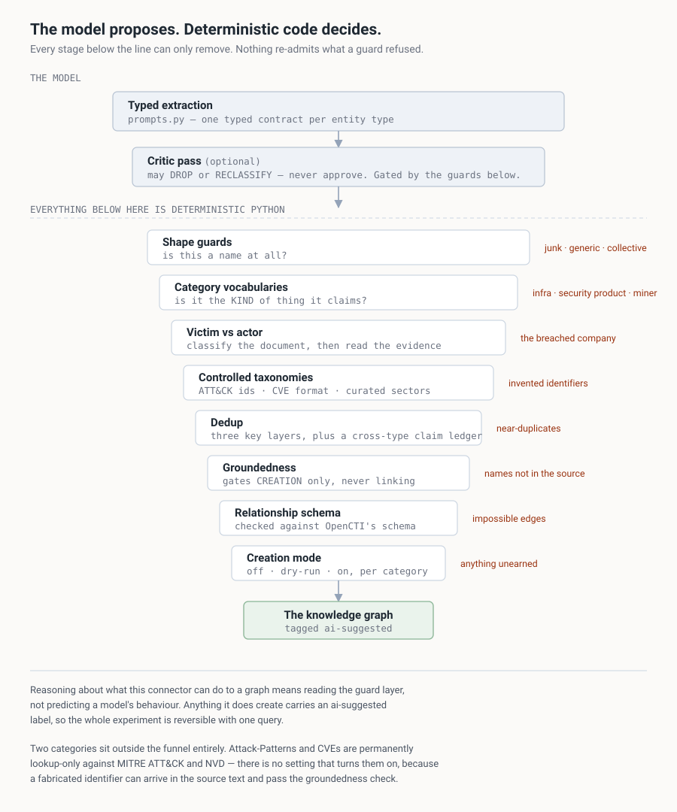
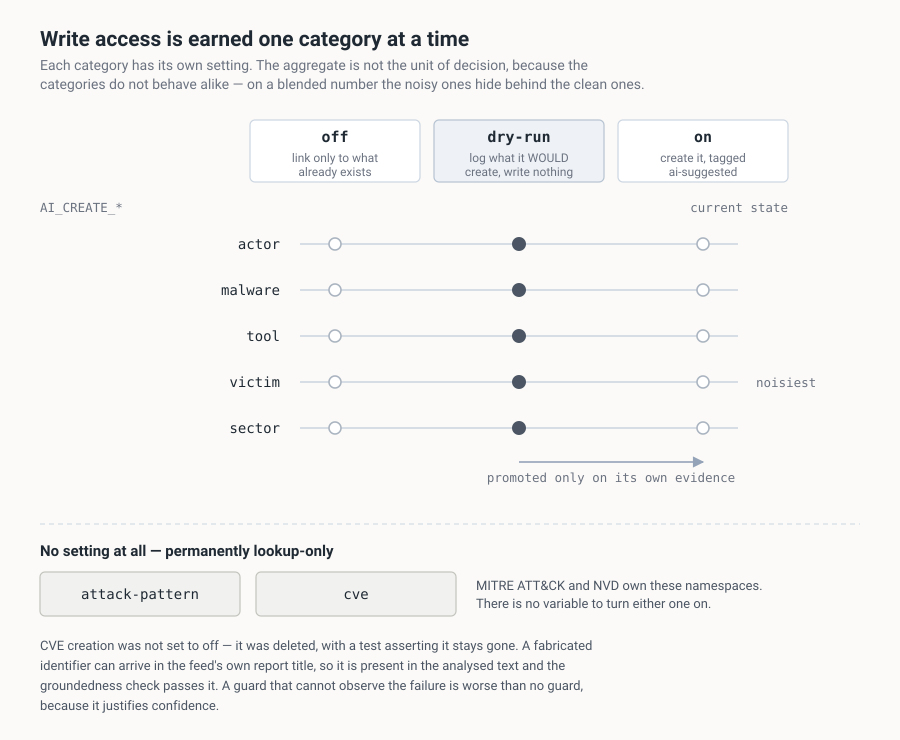

# opencti-ai-enrichment

An OpenCTI enrichment connector where the language model **proposes** entities and
relationships, and deterministic code **decides** what — if anything — reaches the
knowledge graph.

It reads a report with Gemini, connects it to the actors and malware families the
feed left out, and refuses the proposals that would do damage.

[](../../actions/workflows/ci.yml)

---

## The problem

Threat intelligence feeds are very good at the mechanical half of the job and
mostly decline the other half. Indicators arrive in bulk — hashes, domains,
addresses, all correctly typed and attached. What rarely arrives is the connection
between the report and the actor or malware family it is actually about.

You see it most clearly in reports named after the thing they are not linked to. A
write-up titled *DarkMe RAT*, carrying hundreds of indicators, connected to almost
nothing on the malware side. The feed did the part that is cheap to be right about
and skipped the part that needs someone to read prose and be willing to be wrong.

That is the gap this connector works on: turning reports that are rich in
indicators and poor in relationships into something that answers a question.

## Why this isn't just "ask the AI"

Gemini is genuinely good at this. It reads a vendor write-up and comes back with the
actor, the malware family, the techniques and the targeted sectors, as structured
fields. On reports that arrive nearly bare, that is the difference between a node
with some indicators hanging off it and something an analyst can use.

It is also entirely capable of quietly poisoning a knowledge graph. It proposes CVE
identifiers that exist at neither NVD nor CVE.org. It files the breached company as
the threat actor, because ransomware reporting names the victim more prominently
than the gang. It grows a curated sector taxonomy into hundreds of near-duplicates.

Both of those are true at once, and the reason the second one is dangerous is that
it looks exactly like the first. A hallucinated indicator is noise. A hallucinated
**relationship** is a false claim about the world, with a confidence score,
structurally indistinguishable from the true ones next to it — and nothing errors,
nothing fails a health check, and the object count goes up.

## How it decides

Every proposal passes through a funnel, and the model's output is an input to it,
never a decision by it.



In one line: `extraction → critic → shape guards → category vocabularies → dedup →
grounding → relationship schema → creation mode`.

Three properties of that are the actual design.

**Every stage can only subtract.** There is no path where a model's confidence
unlocks something the guards refused. So reasoning about what this connector can do
to your graph means reading `enrichment/guards.py`, not predicting a model's
behaviour.

**The critic is subordinate, not authoritative.** An optional second model pass can
*drop* or *reclassify* a proposal; it cannot approve one. Two models from the same
family agreeing is correlated error with extra steps, not verification — so it runs
before the deterministic layer and its verdicts are gated too.

**Write access is earned per category, not granted once.** More on that below.

### The guard layer

`guards.py` is the file to read. Every predicate is deterministic, name-in/bool-out,
and exists because of a specific class of wrong answer.

- **Is this a name at all?** `is_junk_name` catches truncation and fragments.
  `is_generic_entity_name` catches "the threat actor" arriving where a name belonged.
  `is_collective_descriptor` catches "several Chinese APT groups" — a true statement
  and not an entity.
- **Is it the kind of thing it claims?** This is where most real false positives
  live, because the model's type assignment is much weaker than its extraction.
  `is_known_legit_software` and `is_infra_software` stop Microsoft Exchange being
  filed as malware because a report about exploiting Exchange mentions it forty
  times. `is_security_product` stops the defender's own EDR being recorded as an
  adversary tool.
- **Adversary or victim?** `has_victim_context` and `is_leak_site_operator` exist
  because of the most damaging error available here. Ransomware reporting names the
  breached company more prominently than the gang, so a naive extractor files the
  victim as the actor and the graph ends up asserting a hospital attacked someone.
  Getting it right needs the *document* classified first, then the surrounding
  sentences read as evidence — across the spelling variants the name appears in.
  Judging a name in isolation does not work.

There are 374 tests across this layer and the pipeline around it, and none that
assert anything about the model's output quality. That is deliberate: the model is
not the component that needs regression protection, because it is not the component
that decides.

## Six reversals

Six times I built the ambitious version, watched how it behaved on real content, and
moved the decision *out* of the model and into deterministic code. Six for six in
the same direction, which I would not have predicted.

| Built | Became | Why |
| --- | --- | --- |
| Create Attack-Patterns | Lookup-only against ATT&CK | An invented technique id is a string that pollutes the namespace. Cost almost nothing — technique naming is what Gemini is most reliable at. |
| Create CVEs | Permanently lookup-only | See below. |
| Google Search grounding | Fetch the article myself | Grounding burned a separate tight quota, blocked forced-JSON mode, and left me unable to say what the model had read. |
| Parallel eval harness | The connector owns its accounting | The harness drifted. Once it disagrees you are measuring the harness. |
| Name-shape heuristics | Report-class context | Gangs adopt corporate-looking brands; victims get named without their legal suffix. |
| Unsupervised critic | Subordinate critic | It agreed with the first pass. Same family, same blind spots, now with two votes. |

Two capabilities were **deleted** rather than tuned, and the CVE one is the lesson
worth carrying somewhere else.


Proposed novel CVE identifiers existed at neither NVD nor CVE.org — and some arrived
verbatim in the source feed's own report title. That means the identifier genuinely
*is* in the analysed text, so the groundedness check finds it, confirms it, and waves
it through. The guard built for exactly that error was structurally incapable of
seeing it.

A weak guard makes you cautious, because you know it leaks. A blind guard makes you
*confident*. There was no fix at the guard level, so the capability is gone, with a
test asserting it stays gone.

## Rolling it out



`.env.example` ships the cautious defaults: `AI_READ_ONLY=true`,
`AI_CREATE_STUBS=dry-run`, `CONNECTOR_AUTO=false`. In that posture the connector runs
the entire pipeline — detection, critic, resolution, dedup — and logs exactly what it
would write, without writing it.

That is a starting point, not the destination. Sit there long enough to see how the
model behaves on *your* sources, then promote one category at a time as each earns
it. Per-category matters because precision is not uniform: techniques and countries
resolve cleanly, while victims are the noisiest thing in the system by a wide margin.
On a blended number, victims hide behind techniques and everything looks fine.

The evidence is in `/state/ai_audit.log` and `ai_metrics.jsonl`.
[OBSERVATIONS.md](OBSERVATIONS.md#how-to-tell-which-one-you-are-getting) describes
what to look for.

> Use a **read-only OpenCTI token** for that first period. It makes the guarantee
> structural rather than conditional on this code being correct.

Everything the connector creates carries `ai-suggested`, so the complete set of
AI-originated entities is one query and undoing the experiment is one bulk operation.

## Quick start

```bash
git clone https://github.com/ashwinvis98/opencti-ai-enrichment
cd opencti-ai-enrichment

# The test suite needs no credentials, no network and no OpenCTI.
pip install -r requirements-dev.txt
python -m pytest tests/ -q          # 374 passed
```

To run it against a platform:

```bash
cp .env.example .env
# fill in GEMINI_API_KEY, OPENCTI_TOKEN, CONNECTOR_ID
docker build -t opencti-ai-enrichment .
docker run --env-file .env -v enrichment-state:/state opencti-ai-enrichment
```

A **named volume** for `/state`, not a bind mount. The image creates `/state` owned
by the container's unprivileged user and a named volume inherits that; a bind mount
onto a host directory owned by root leaves the container unable to write, and the
only symptom is an audit log that never appears.

## Layout

```
enrichment/
  prompts.py     typed extraction contracts, one per entity type, plus the critic
  names.py       normalisation and the three dedup key layers
  orgs.py        organisation keys, acronyms, title-derived canonicalisation
  grounding.py   deterministic source-evidence check (gates creation only)
  guards.py      the vocabularies and predicates that refuse bad entities
  relations.py   relationship type/direction against OpenCTI's own schema
  fetch.py       reference retrieval with SSRF protection
  vocab.py       STIX open-vocabulary normalisers
  metrics.py     per-category outcome matrix
  llm.py         the Gemini call — 15 lines, the only vendor SDK import
  connector.py   configuration, pipeline, decision funnel
tests/           374 tests, concentrated on the guard layer
tools/           offline labelling and scoring of recorded outcomes
docs/            CONFIGURATION.md and the diagrams above
```

Start with `guards.py`. That is where the interesting failures live.

15 lines of model-calling code against 4,385 lines of everything else is the honest
summary of this project: almost none of it is about calling a model.

## Scope and honesty

**What it handles.** Report, Intrusion-Set, Threat-Actor-Group, Malware, Campaign,
Vulnerability. Each has its own extraction contract and relationship rules.

**What it is not.**

- Not a general AI-for-CTI platform. One connector, one provider, six entity types.
- **Only Gemini has been run.** `llm.py` isolates the SDK, which would make another
  provider a contained change, but I have not done it. There is deliberately no
  provider abstraction — an interface with one implementation advertises portability
  it has not demonstrated.
- Not autonomous, and not trying to be. Which categories may write is a human
  decision, made per category, informed by what the logs show.
- Not a fix for attribution gaps. Where the source material does not attribute, the
  model generally does not either — there is a worked example in
  [OBSERVATIONS.md](OBSERVATIONS.md#it-declines-exactly-where-the-feed-declines).
- The evaluation corpus is not shippable. `tools/` is published as methodology; the
  data is real breach reporting about real organisations, and a fabricated
  substitute would produce something that looks like evidence and is not.
- Guards are code and code is wrong. The mitigations are cautious defaults,
  reversibility, and the test suite — not a belief that the guard layer is correct.
- The confidence score is the model's own self-report, and it comes back high on
  nearly every document regardless of how hard the document was. Treat it as
  provenance, not quality. It is the weakest part of the design as it stands.

## Status

Working, and run against a live OSINT feed. The extraction does what it is meant to.
The guard layer is where most of the engineering went, and the things it refuses are
things I watched the model get wrong rather than hypotheticals.

| | |
| --- | --- |
| [OBSERVATIONS.md](OBSERVATIONS.md) | Where Gemini worked well and where it went wrong, with real examples on both sides. |
| [docs/CONFIGURATION.md](docs/CONFIGURATION.md) | All 40 environment variables, and why each default is the cautious one. |

## Licence

[Apache 2.0](LICENSE)
